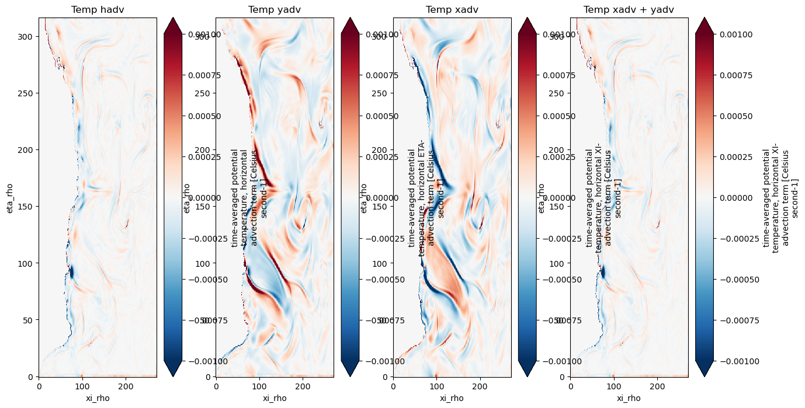
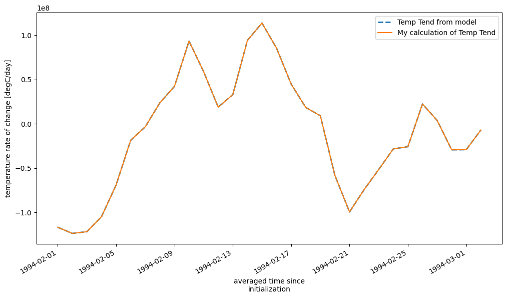
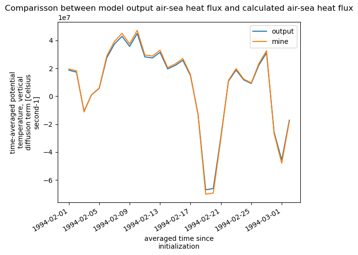
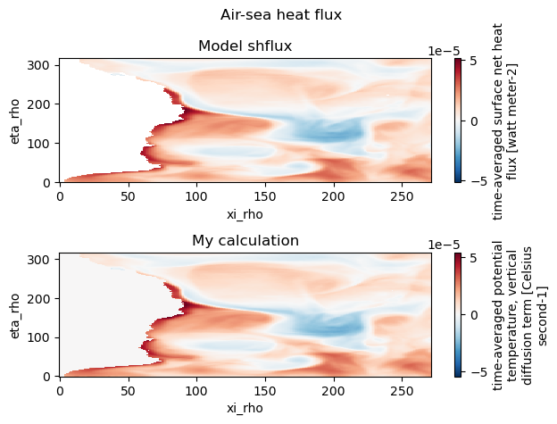
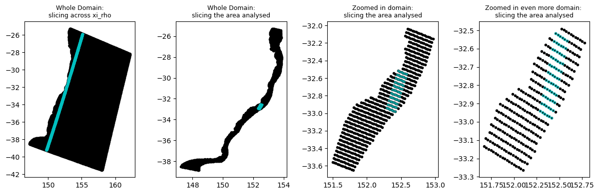
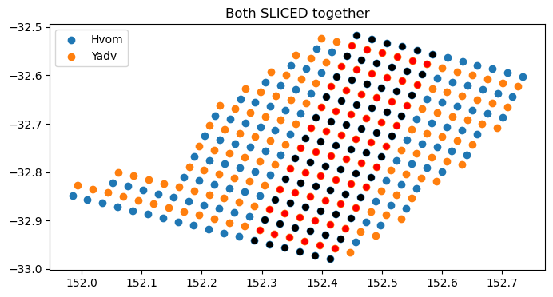
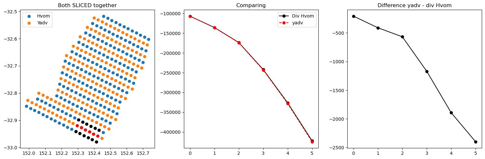
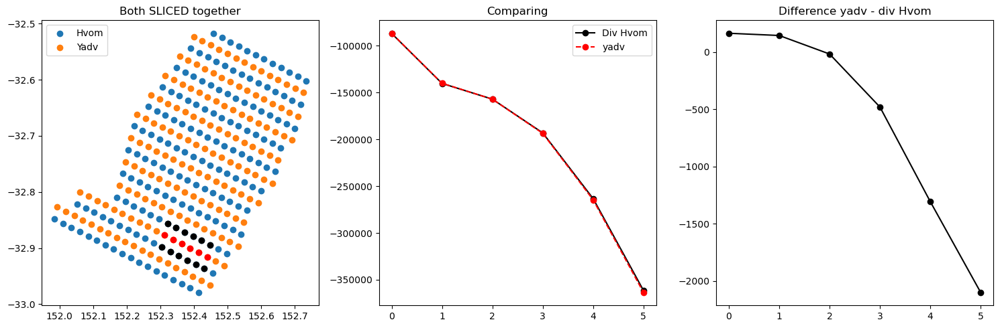
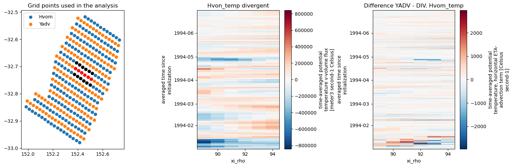

# Ocean Heat Budget in ROMS
### Author: Fernando Sobral
### Date: 26/July/2024
### Summary

This document aims to provide useful information about the heat budget in ROMS and best practices following a lengthy process of analyzing the model outputs. It not only shows the correspondence of Ocean Heat Budget (OHB) terms, but also what can’t be correlated. The key takeaway is that there isn’t a straightforward correlation between the diagnostic terms (DIA) and the averaged terms (AVG) due to differences in the advection and time-stepping schemes, so they won’t be proportional as provided. Therefore, it is easier to use them separately. 


---

## Table of Contents
0. [The problem being addressed](#the-problem-being-addressed)
1. [Introduction](#introduction)
2. [The heat budget equation](#the-heat-budget-equation)
3. [The ROMS diagnostic](#the-roms-diagnostic)
    - [The Air-sea heat flux](#the-air-sea-heat-flux)
4. [Huon_temp and Hvom_temp and temp_hadv relationship](#huon_temp-and-hvom_temp-and-temp_hadv-relationship)
5. [The diffusion term](#the-diffusion-term)
6. [Good practices when analysing the data](#good-practices-when-analysing-the-data)


---

## The problem being addressed

The main challenge that initiated the analysis was to find the relationship between the divergent diagnostic terms and the flux terms (Huon_temp and Hvom_temp) from the averaged output. If this correlation could be established, it would be possible to use the flux terms on the grid faces with a proportional correspondence to the change in temperature at the grid cell center. The application of this correlation is that it could provide confidence that a cross-contour heat transport amount is correct because it conserves the heat within the system.

<br>


## Introduction
The Ocean Heat Budget (OHB) is a useful approach to provide information about the drivers of ocean heat. It is designed to offer an accurate decomposition of the terms controlling the temperature change over time in a specific area.

This document contains relevant discussions that I have had with Neil Malan, Fabio Dias, Ryan Holmes, and John Wilkin.

<br>

## The heat budget equation

By design, the ROMS model satisfies the heat conservation equation at every grid point. The time evolution of temperature in the ocean is given by the sum of net heat exchange with the atmosphere, divergence of advective heat transport by horizontal and vertical velocities, and three-dimensional diffusive processes:

$$
\frac{\partial T}{\partial t} = \frac{\partial Q}{\partial z} - \rho_0 c_p \Big[ \textbf{u} \cdot \nabla T - \Big( \kappa_H \nabla^2_H T + \kappa_z \frac{\partial^2 T}{\partial z^2} + K^{turb}_T \Big)\Big ]
$$


<br>

## The ROMS diagnostic
To obtain the OHB terms in ROMS, you must use the diagnostic output. This output provides all the necessary terms to close the heat budget. When considering the diagnostic outputs provided by ROMS, the rate of temperature change is represented by the following equation:

temp_rate = temp_xadv + temp_yadv + temp_vadv + temp_xdiff + temp_ydiff + temp_vdiff

Using these terms, you can close the budget in any selected area within your domain. You can replace temp_xadv + temp_yadv with temp_hadv and similarly for diffusion, replace temp_xdiff + temp_ydiff with temp_hdiff. Following is an image showing the equivalency of temp_xadv + temp_yadv = temp_hadv.

<br>


*Fig: Calculating temp_hadv based on the x and y terms.*

<br>

The temp_rate variable is provided, but you can also calculate it using all the variables above. 

```python
volume = dx * dy * dz

# The order is: horizontal advection (x and y), vertical adv, horizontal (x and y) and vertical diffusitity (z)
# Multiplying per volume and summing the 3 dimensions: integral
mine_heat_budget = (diag.temp_xadv * volume).sum(['s_rho', 'xi_rho', 'eta_rho']) + (diag.temp_yadv * volume).sum(['s_rho', 'xi_rho', 'eta_rho']) + \
                    (diag.temp_vadv * volume).sum(['s_rho', 'xi_rho', 'eta_rho']) + \
                    (diag.temp_xdiff * volume).sum(['s_rho', 'xi_rho', 'eta_rho']) + (diag.temp_ydiff * volume).sum(['s_rho', 'xi_rho', 'eta_rho']) + \
                    (diag.temp_vdiff * volume).sum(['s_rho', 'xi_rho', 'eta_rho'])


# Temp rate is the temperature tendency output from the model. 
# It's a daily 3D field and to compare with my calculation I also have to integrate it
output_temp_tendency = (diag.temp_rate * volume).sum(['s_rho', 'xi_rho', 'eta_rho'])

```

<br>
<br>


*Fig: Comparison between output temp_rate and calcualted by hand using the diagnostic terms.*


<br>
<br>

### The Air-sea heat flux

About the air-sea heat flux in [ROMS forum](https://www.myroms.org/forum/viewtopic.php?t=2420).
Because the air-sea heat flux is applied as the surface boundary condition to temp_vdiff and so is already included in the vertical divergence.
> If you vertically integrate temp_vdiff = d/dz*(K_v*dT/dz) between the limits z = -h and z = zeta then you should simply get K_v*dT/dz |z = zeta minus K_v*dT/dz |z = -h which is shflux/(Cp*rho0) minus 0. 

```python
Cp = 4181.3

# Model air-sea heat flux
((ds.shflux / (ds.rho0 * Cp)) * dx * dy).sum(['xi_rho', 'eta_rho']).plot(label='output')

# My calculation of air-sea flux
(diag.temp_vdiff * volume).sum(['xi_rho', 'eta_rho', 's_rho']).plot(label='mine')

plt.title('Comparisson between model output air-sea heat flux and calculated air-sea heat flux')
plt.legend()

```

<br>
<br>



*Fig: Air-Sea heat flux Volume integrated for the whole domain over time.*

<br>
<br>

```python
# Comparing the vertical diffusivity with the air sea heat flux
# Firstly over time, So I have to integrate horizontally the model output
Cp = 4181.3

fig, ax = plt.subplots(nrows=2)
# Model air-sea heat flux
(ds.shflux/(Cp * ds.rho0)).mean('ocean_time').plot(ax=ax[0])
ax[0].set_title('Model shflux')
# My calculation of air-sea flux
(diag.temp_vdiff * dz).mean('ocean_time').sum(['s_rho']).plot(ax=ax[1])
ax[1].set_title('My calculation')

plt.suptitle('Air-sea heat flux')
fig.tight_layout()

```

<br>
<br>



*Fig: Time-mean air-Sea heat flux vertical integrated for the whole domain.*


<br>
<br>

## Huon_temp and Hvom_temp and temp_hadv relationship
One of the big lessons while trying to compare variables calculated in AVG (in this case Huon_temp and Hvom_temp) with variables calculated in DIA (like temp_xadv and temp_yadv) is that they are not comparable.

There is a good topic in [ROMS' forum](https://www.myroms.org/forum/viewtopic.php?t=5481) about it.

There are important differences while theses variables are being calculated when runing the model.
>The _xadv and _yadv terms (and their divergence which is already saved for you in the companion _hadv diagnostics) are the fluxes through the faces (time averaged) exactly as ROMS computed them according to the selected advection scheme. In the case of the high order Akima and weighted-upwind schemes, these fluxes are computed over a 3 or 4 grid cell stencil so their divergence is not a simple difference of the u*temp terms on the faces of a single cell. 
>Moreover, the ROMS time varying vertical s-coordinate means that the cell thickness, H, and hence cell face area itself (H/n) varies with time on every time step. Thus the time average <u*temp> multiplied by the time average layer area <H/n> is not exactly equal to <H/n*u*temp> because the triple nonlinearity of the perturbations <H'u'temp'> is not zero.

Before knowing that, some tests were performed and even that the result are not quite the same, the two outputs have similarities. I did some analysis to compare them and the following plot shows the area used for that. It was chosen a shelf water area.

<br>
<br>


*Fig: First pannel to the left to show that it was chosen columns and the other pannels shows the area used for the analysis.*

<br>
<br>

I made sure that I was taking the right grid cells for the analysis.

<br>
<br>



*Fig: Grid cells selected for both temp_yadv and Hvom_temp.*

<br>
<br>

And these are the comparison.

<br>
<br>



*Fig: comparison between yadv and Hvom.*
<br>
<br>

And the comparison over time to see if there was an accumulative factor. Which can't be seen.

<br>
<br>


*Fig: comparison between yadv and Hvom over time.*

<br>
<br>

## The diffusion term
Based on all the information provided, how would be possible to calculate the heat transport across contours? In this case, only Hu/Hv aren't enough. We also need the diffusion terms. And for those, we need to calculate them. 

First of all, you need to figure out, which scheme you have used in the model setup. And from that, calculate [manually the diffusion](https://www.myroms.org/wiki/Horizontal_Mixing#Horizontal_Diffusion). 

In my case, I have to use the Laplacian horizontal diffusion. A way to find this is looking the cpp defs. My model has TS_DIF2 (harmonic mixing tracers) and if biharmonic, it would have defined TS_DIF4 ([have a look into the CPP defs](https://www.myroms.org/wiki/cppdefs.h#Options_for_horizontal_mixing_of_tracers))


I have managed to calculate the horizontal diffusion. The $\nu2$ value come from the *ocean.in* file, and it is equal to 55.

$\frac{\partial}{\partial \xi}\Big(\frac{\nu_2H_zm}{n}\frac{\partial C}{\partial \xi}\Big) + \frac{\partial}{\partial \eta}\Big(\frac{\nu_2H_zn}{m}\frac{\partial C}{\partial \eta}\Big)$


```python

# Value for the viscosity horizontal diffusion coefficient (from ocean.in)
nu2 = 55

dtemp_dxi = (temp.shift(xi_rho=-1) - temp.shift(xi_rho=1)) / (ds.dx.shift(xi_rho=-1) + ds.dx.shift(xi_rho=1))
dtemp_deta = (temp.shift(eta_rho=-1) - temp.shift(eta_rho=1)) / (ds.dy.shift(eta_rho=-1) + ds.dy.shift(eta_rho=1))

term1 = (nu2 * ds.dz * ds.dx / ds.dy) * dtemp_dxi
term2 = (nu2 * ds.dz * ds.dy / ds.dx) * dtemp_deta

# Derivatives of the terms using centered differences
dterm1_dxi = (term1.shift(xi_rho=-1) - term1.shift(xi_rho=1)) / (ds.dx.shift(xi_rho=-1) + ds.dx.shift(xi_rho=1))
dterm2_deta = (term2.shift(eta_rho=-1) - term2.shift(eta_rho=1)) / (ds.dy.shift(eta_rho=-1) + ds.dy.shift(eta_rho=1))


# Sum the components to get the horizontal diffusion term
horizontal_diffusion = dterm1_dxi + dterm2_deta

horizontal_diffusion.sum('s_rho').where(ds.h<200).where(~ds.dz.isel(s_rho=-1).isnull()).isel(ocean_time=-1).plot()

```
<br>
<br>


*Fig: Horizontal diffusion vertically integrated.*

John Wilkin words about the efficiency of calculating by hand the horizontal mixing:
>Diffusive fluxes through a cell side multiplied by elemental area (I think that's what you are asking, in analogy to advective flux u*temp times cell face area H_on_n) are not diagnostics we save. 

>The saved diffusion term is only the flux divergence. 
See the docs at https://www.myroms.org/wiki/Horizontal_Mixing#Horizontal_Diffusion for guidance on the correct way to calculate these.

>I created the Huon outputs because in tidal flows there can be a very strong nonlinear triple correlation between sea level (hence Hz) and phase of tide (u) and tracer. Using average zeta times the conventional u*temp average didn't balance. 
But for diffusive fluxes, the Hz/mn term multiplies only dC/dxi (e.g. Eqn. 11 at the link above) and you don't have that complicated nonlinearity of a correlated velocity. You should be able to get a nice balance. 


<br>
<br>

## Good practices when analysing the data
- Masking land with NaN, to make sure it won't influentiate when integrating.
- Calculate your own temp_rate and comparing with the model output
- Calculate your own air-sea flux as the vertical integral of the temp_vdiff and compare with the air-sea flux provided in the average data (to be confirmed...)
- Because the DIA files can't be read with xroms, since it does not contain the zeta variable (for the version used as reference while writing this document), to easily have the metrics calculated, read the AVG file with xroms and assign the metrics to the DIA files read with xarray.
- When calculating the heat you'll need the $\rho_0$ and $C_p$. These values have to come from the model, and you can find them in the file called /g/data/fu5/trunk/ROMS/Modules/mod_scalars.F on Gadi. Sometimes I used approximate values showed in this file.


---

