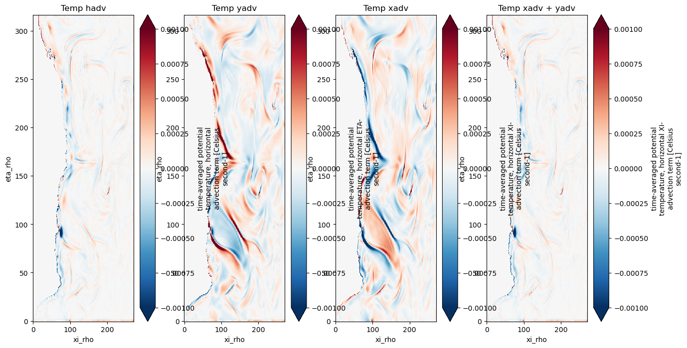

# Ocean Heat Budget in ROMS
### Author: Fernando Sobral
### Date: 26/July/2024
### Summary
This document aims to provide useful information about the heat budget in ROMS and best practices after a long process of analysis of the model outputs.

---

## Table of Contents
1. [Introduction](#introduction)
2. [The ROMS diagnostic and average outputs](#the-roms-diagnostic-and-average-outputs)
3. [The heat budget equation](#the-heat-budget-equation)
4. [Huon_temp and Hvom_temp and temp_hadv relationship](#huon_temp-and-hvom_temp-and-temp_hadv-relationship)
5. [Good practices when analysing the data](#good-practices-when-analysing-the-data)
<!-- 5. [References](#references) -->

---

## Introduction
The Ocean Heat Budget (OHB) is a usefull approach to provide information about the ocean heat drivers. It is meant to give you an accurate decomposition of the terms controlling the temperature change over time in a specific area. 

## The heat budget equation

By design, the ROMS model satisfy the heat conservation equation at every grid poing. The time evolution of temperature in the ocean is given by the sum of net heat exchange with the atmosphere, divergence of advective heat transport by horizontal and vertical velocities, and three-dimensional diffusive processes:

$$
\frac{\partial T}{\partial t} = \frac{\partial Q}{\partial z} - \rho_0 c_p \Big[ \textbf{u} \cdot \nabla T - \Big( \kappa_H \nabla^2_H T + \kappa_z \frac{\partial^2 T}{\partial z^2} + K^{turb}_T \Big)\Big ]
$$

## The ROMS diagnostic and average outputs
To obtain the OHB terms in ROMS you must use the diagnostic output. This output provides you all the necessary terms to close the heat budget.
In terms of ROMS diagnostic outputs, this equation is in the following format:

temp_rate = temp_xadv + temp_yadv + temp_vadv + temp_xdiff + temp_ydiff + $\int$ temp_vdiff $dz$

Using these terms, you can close the budget in any selected area within your domain.
You can replace temp_xadv + temp_yadv by temp_hadv and the same for diffusion, temp_xdiff + temp_ydiff by temp_hdiff. The temp_rate variable is provided, but you can also calculate it using all the variables above. 

## Huon_temp and Hvom_temp and temp_hadv relationship
[Summarize the main points of the document and provide any concluding remarks.]

## Understanding the diagnostic data

## Good practices when analysing the data
- Masking land with NaN, to make sure it won't influentiate when integrating.
- Calculate your own temp_rate and comparing with the model output
- Calculate your own air-sea flux as the vertical integral of the temp_vdiff and compare with the air-sea flux provided in the average data (to be confirmed...)
- Because the DIA files can't be read with xroms, since it does not contain the zeta variable (for the version used as reference while writing this document), to easily have the metrics calculated, read the AVG file with xroms and assign the metrics to the DIA files read with xarray.

<!-- ## References
[1] [Reference 1]
[2] [Reference 2] -->

---
<!-- 
### Appendix (Optional)
[Include any additional information or appendices here.] -->
